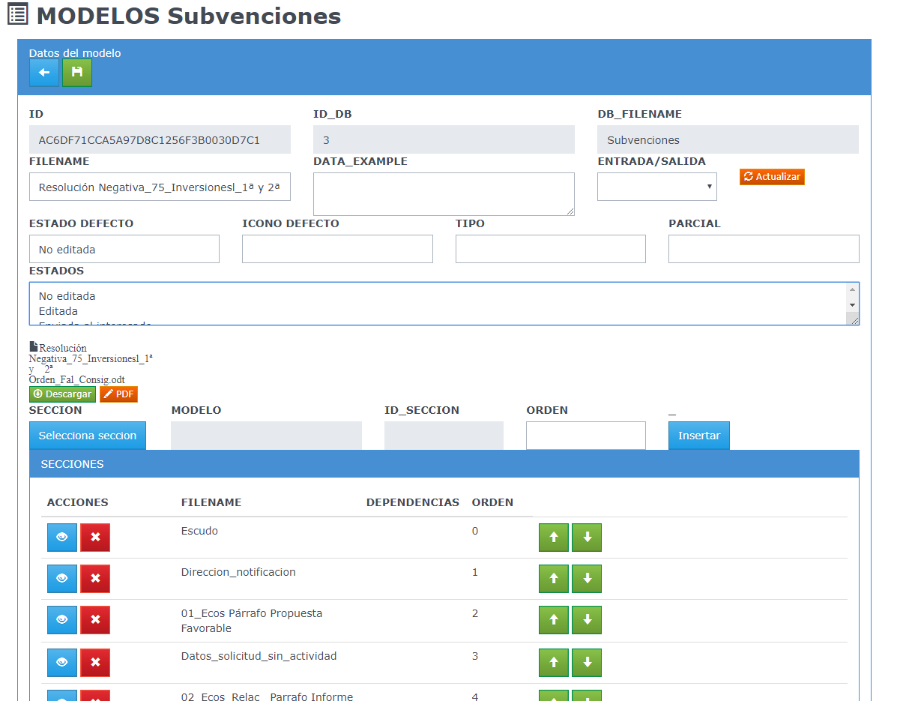
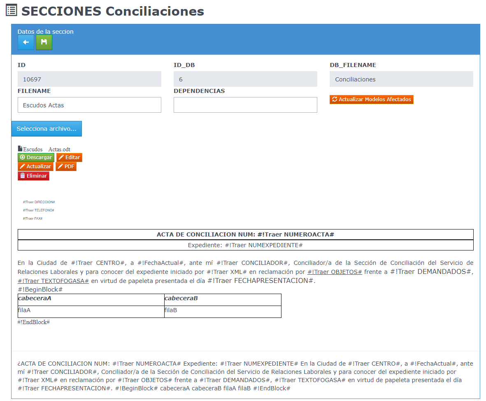

# GenericDoc.
Autor: Andrés García Meroño

Fecha: 22/11/2018

## Índice de contenido

## Introducción

Generic Doc es una herramienta que permite la generación de documentos OpenOffice/LibreOffice o PDF mediante la combinación de modelos o plantillas con un jsonde datos.

La idea principal es que los modelos están compuestos por secciones lo que permite su reutilización para la composición de otros modelos.

Una sección es un documento Open/Libre Office que contiene parte del documento que se quiere configurar. Además de texto, tablas, imágenes (toda la funcionalidad que ofrece el editor de textos), se insertan cadenas de texto con una sintaxis especial que es la que permite la combinación de datos con el texto que se está formando.

La sintaxis #!...# va a permitir:

* Recuperar datos del json y combinarlos en el documento
* Transformar los datos y darles formato: expresiones, fechas, currency.
* Iterar sobre un conjunto de datos: bucles, tablas, informes.
* Ejecuciones condicionales de código: if-else
* declaración de otros datos a partir de los iniciales: sumas, totales....

## Creacion de un modelo

La mínima configuración para definir un modelo es ponerke un nombre y seleccionar las secciones que lo va a componer en el orden necesario.

Adicionalmente se puede  definir los estados en los que ese modelo puede estar y cual es el estado inicial de un documento generado a partir de ese modelo.

Otras funciones son:

* Agrupar modelos similares por tipo.
* Definir qué parcial de Angular es el responsable de la visualizar el documento generado
* Establecer el icono por defecto con el que se visualizará el documento.
* Asignar un conjunto de datos de ejemplo para poder desarrollar el modelo sin conexión a base de datos.

## Creación de una sección

Para crear una sección simplemente hay que ponerle un nombre y adjuntar un fichero Open/Libre Office. Dentro de dicho fichero se almacena parte de la plantilla que se pretende diseñar.

Adicionalmente, en una sección se pueden especificar variables (dependencias) que no tienen porqué estar en el json de datos en el momento de la combinación.

## Formato de los comandos #!..#

Dentro del documento se pueden insertar comandos que permitirán la manipulación de datos y dar forma al documento final.

Cada comando comienza con el prefijo #! y termina con el caracter # y tiene esta estructura: #!Accion# o #!Accion parametros#

Esta es una lista de los comandos implementados:

* #!Traer expresion# : vuelca la evaluacion de la expresion al documento final
* #!TraerFecha expresion# : la expresion la convierte a un formato fecha "dia del mes de año"
* #!TraerFechaCorta expresion# : la expresion la convierte a un formato fecha "dd/mm/yyyy"
* #!TraerMoneda expresion# : la expresion la convierte a un formato "###.###,##"
* #!Contador# : muestra un valor numerico incrementado cada vez que se invoca, empieza en 1
* #!FechaActual# : muestra la fecha actual en formato largo
* #!BeginBlock# : inicio de bloque. Todo lo que se escriba dentro no sale en el documento. Sí se ejecutan las acciones.
* #!EndBlock# : fin de bloque. Util para formatear código embebido.
* #!For expr1=expr2:expr3# : inicio de bucle, expr1 es la variable, expr2 y expr3 son los límites. expr2<=expr3
* #!Next expr# : fin de bucle. Hay que indicar el nombre de la variable. Se permiten bucles anidados.
* #!If expr1(=|<|>|<=|>=|<>)expr2# ... #!Else# ... #!EndIf# : Condicional. Permite realizar textos condicionales.
* #!Declare expr1=expr2# : declaracion de variabl.

Las expresiones tienen las siguientes consideraciones:

* El acceso a los datos usa la semántica "campo.campo\[indice\]"
* Los objetos arrays del json se extienden con metadatos ".LENGTH", ".LBOUND", ".UBOUND" para poder iterar sobre ellos
* Actualmente la expresiones sólo son estáticas. No se permiten operaciones
* Un token acabado en "?" indica el valor de una dependencia

## API del Servicio

Estos son los servicios Generic_REST definidos: (basePath /services/genericRestService)

* DATABASE, MODELO, SECCION, MODELO_SECCION, DOC : Tablas raw de datos
* VIEW_MODELOS, VIEW_MODELOS_SECCION, VIEW_SECCION, VIEW_DOCUMENTOS : vistas para facilitar busquedas

Servicios de gestión de anexos: (basePath /services/attachmentService)
Todos los adjuntos están referenciados con un db_id y un unid

* /addAttachment : (POST, multipart_ form_data, campos: dbid, unid, attach) sube un adjunto 
* /getAllAttachmentNames/{dbid}/{unid} : (GET) devuelve un array de string con los nombres de los adjuntos/{dbid}/{unid} : (GET) devuelve un array de string con los nombres de los adjuntos
* /deleteAttachment/{dbid}/{unid} : (DELETE) elimina un adjunto
* /viewAttachment/{dbid}/{unid} : (GET, urlparam: name) devuelve un adjunto según su nombre
* /editAttachment/{dbid}/{unid} : (GET, urlparam: name) copia el adjunto a la carpeta temporal y activa la edición
* /updateAttachment/{dbid}/{unid} : (GET, urlparam: name) actualiza el adjunto con el contenido de su homólogo en la carpeta temporal

Servicios de gestión de modelos y documentos: (basepath /services/genericDocService)

* /instanciarModelo/{dbid}/{unid} : (POST, urlparam: name, body: json) realiza la combinación de un modelo junto con los datos
* /actualizaModelo/{dbid}/{unid} : (POST, urlparam: name) refresca el adjunto asociado al modelo en base a sus secciones
* /actualizaModeloSeccion/{dbid}/{unid} : (POST, urlparam: name) actualiza todos los modelos afectados por una seccion
* /getPDF/{dbid}/{unid} : (POST, urlparam: name,table,addPDF) obtiene el HTML, TXT y opcionalmente el PDF asociado a un documento ODT y actualiza el contenido de dichos campos del documento

## Estructura del fichero json y dependencias

El json debe ser un objeto, con cualquier cantidad de datos. El almacén de dependencias (variables) se define en la propiedad "dep" del objeto json.

